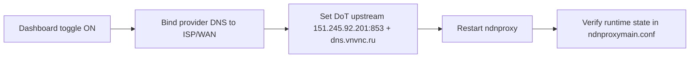
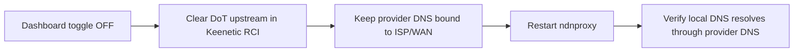

# AIWAY Manager for Keenetic

`AIWAY Manager` is an **optional** router-side control surface for `aiway`.

If you only want the core product, you can stop at:

1. `sudo bash install.sh` on the VPS
2. set your devices or router to use that DNS

If you want a polished control panel on the router itself, this doc is for you.

## At a glance

| Mode | What it means | When to use it |
|:--|:--|:--|
| **DNS-only** | Keenetic uses an existing `aiway` DNS endpoint (`IP + SNI`) | You already have a working VPS and just want router control |
| **Managed VPS** | Keenetic talks to the VPS over SSH and can manage it | You want install / sync / reset / uninstall from the dashboard |
| **Legacy VPS** | Keenetic reads and lightly manages an older manual setup | You already have a hand-tuned server and do not want a destructive migration |

## One-line install on the router

Open Entware shell on the router:

```sh
ssh admin@192.168.1.1
exec sh
```

Then install `AIWAY Manager` with one command:

```sh
wget -qO- https://raw.githubusercontent.com/kirniy/aiway/main/router/scripts/install.sh | sh
```

If `wget` is unavailable:

```sh
curl -fsSL https://raw.githubusercontent.com/kirniy/aiway/main/router/scripts/install.sh | sh
```

What the installer does:

- detects the Keenetic / Entware architecture
- finds the latest GitHub release
- downloads the correct `.ipk`
- installs it via `opkg`
- starts the dashboard service
- prints the local URL

Default URL:

```text
http://192.168.1.1:2233/routing
```

## What the dashboard does

- runs directly on Keenetic
- supports `DNS-only`, `Managed VPS`, and `Legacy VPS`
- stores profiles for multiple servers
- supports SSH key and password auth
- accepts a private SSH key directly from the web UI
- shows real router DNS runtime state, not just intended state
- provides LAN-friendly CLI/API

## The important DNS behavior

This is the part that really matters on Keenetic.

When `AIWAY DNS` is **ON**:



When `AIWAY DNS` is **OFF**:



Why this matters:

- on this router, provider DNS can be private ISP addresses like `10.59.3.19` and `10.81.3.19`
- if AWG owns the default route, those DNS addresses can accidentally go into the tunnel
- `AIWAY Manager` fixes that by pinning provider DNS back to the ISP path

So `AIWAY OFF` now means:

- no DoT upstream
- provider DNS only
- provider DNS forced through WAN/ISP, not AWG

## Control model

### DNS-only

Use this when `aiway` already exists somewhere else.

You only fill in:

- endpoint IP / hostname
- DoT SNI / domain

No SSH is required.

### Managed VPS

Use this when the router should manage the server itself.

Available actions:

- install
- sync
- reset
- uninstall
- domain add/remove
- health checks

### Legacy VPS

Use this when the server already has an older, hand-made setup.

What the dashboard does safely:

- reads real `Angie` / `Blocky` / DNS state
- checks SSH reachability
- lists legacy custom domains
- adds/removes domains with targeted config edits

What it does **not** do automatically:

- destructive reinstall
- blind reset of your hand-tuned server

## LAN CLI / API

The dashboard exposes a simple API for humans and agents on the local network.

Examples:

```bash
aiway-manager status --endpoint http://192.168.1.1:2233
aiway-manager check --endpoint http://192.168.1.1:2233
aiway-manager dns on --endpoint http://192.168.1.1:2233
aiway-manager dns off --endpoint http://192.168.1.1:2233
aiway-manager domains add perplexity.ai --endpoint http://192.168.1.1:2233
```

## Supported Keenetic targets

`AIWAY Manager` is not tied to one single model.

Current package targets:

- `mips-3.4_kn`
- `mipsel-3.4_kn`
- `aarch64-3.10_kn`

That covers multiple Keenetic devices that use Entware.

## Not supported yet

- OpenWrt
- AsusWRT
- MikroTik
- FreshTomato
- other router families

The concept is portable, but those platforms need their own DNS / route integration layer.

## Router package structure

| Path | Purpose |
|:--|:--|
| `router/cmd/aiway-manager` | Go daemon + CLI |
| `router/web` | Dashboard frontend |
| `router/webui/dist` | embedded built frontend |
| `router/package` | Entware init / lifecycle scripts |
| `router/scripts/install.sh` | one-line installer |

## Build from source

```bash
cd router
make package
```

Produced packages:

- `aiway-manager_<version>_aarch64-3.10-kn.ipk`
- `aiway-manager_<version>_mips-3.4-kn.ipk`
- `aiway-manager_<version>_mipsel-3.4-kn.ipk`

## VPS side companion

The router talks to the VPS through `aiwayctl`.

Main commands:

- `aiwayctl status`
- `aiwayctl doctor`
- `aiwayctl list-domains`
- `aiwayctl add-domain example.com`
- `aiwayctl remove-domain example.com`
- `aiwayctl reapply`
- `aiwayctl uninstall`

## Practical guidance

If you just want the safest setup:

- leave the VPS setup alone
- connect the dashboard in `DNS-only` or `Legacy VPS` mode
- use the router only for DNS control and visibility

If you want the most automation:

- move to a fully managed VPS profile
- let the router own the lifecycle and health-checking
